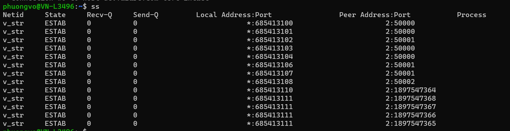

# What is firmware?


Firmware is a type of software that is embedded in a hardware device. It is typically used to control the device's operation and to provide basic functionality. Firmware is typically stored in read-only memory (ROM) and cannot be changed by the user.

In Linux, firmware is typically stored in a package called linux-firmware. This package contains firmware for a variety of hardware devices, including network cards, graphics cards, and storage devices. The firmware in linux-firmware is typically provided by the hardware manufacturer.

When a Linux system boots, it loads the firmware for all of the hardware devices that are present. This firmware is then used to initialize the devices and to start the operating system.

Firmware updates are important for ensuring that hardware devices are functioning properly. Updates can fix bugs, add new features, or improve performance. Firmware updates can be installed manually or automatically.

To install firmware updates manually, you can download the updated firmware from the hardware manufacturer's website and then install it using the appropriate tool. To install firmware updates automatically, you can use a tool like fwupd. Fwupd is a daemon that automatically checks for firmware updates and installs them when they are available.

Firmware is an important part of Linux. It provides the basic functionality that is needed for hardware devices to work. Firmware updates are important for ensuring that hardware devices are functioning properly.

# When using CentOS, which file contains the way the useradd command will define system and user account unique identifiers (UIDs)?

In CentOS, the file that contains the way the `useradd` command will define system and user account unique identifiers (UIDs) is `/etc/login.defs`. 

The `login.defs` file is a configuration file that contains various system login and user account settings. It includes parameters that affect the behavior of the `useradd` command, including the range of UIDs that can be assigned to system and user accounts. 

To view or modify the UID-related parameters in the `login.defs` file, you can use a text editor to open the file as the root user:

```
sudo nano /etc/login.defs
```

In the file, you can locate the following parameters related to UID assignment:

- `UID_MIN`: The minimum UID value that can be assigned to a regular user account.
- `UID_MAX`: The maximum UID value that can be assigned to a regular user account.
- `SYS_UID_MIN`: The minimum UID value that can be assigned to a system account.
- `SYS_UID_MAX`: The maximum UID value that can be assigned to a system account.


You can modify these values to change the UID range for user and system accounts on your CentOS system. However, it's important to note that changing these values could affect the behavior of certain system tools and applications, so you should be cautious and test any changes thoroughly before implementing them in a production environment.


# In a Bash shell, what would you type to set an environment variable of EDITOR to nano and add the setting to your environment?

To set an environment variable of EDITOR to nano and add the setting to your environment in a Bash shell, you would type the following command:

```bash
export EDITOR=nano
```

# On most modern Linux systems, what file contains the list of users and encrypted versions of their passwords?

`/etc/passwd`

# What command would you use to encrypt a single file?

To encrypt a single file in Linux, you can use the following command:

```
gpg -c filename.txt
```

This command will encrypt the file `filename.txt` and create a new file called `filename.txt.gpg`. The new file will be encrypted using the GnuPG encryption algorithm.

To decrypt the file, you can use the following command:

```
gpg -d filename.txt.gpg
```

This command will decrypt the file `filename.txt.gpg` and create a new file called `filename.txt`. The new file will be decrypted using the GnuPG encryption algorithm.

You can also use the following command to encrypt a file and specify a passphrase:

```
gpg -c -p passphrase filename.txt
```

This command will encrypt the file `filename.txt` and create a new file called `filename.txt.gpg`. The new file will be encrypted using the GnuPG encryption algorithm and the passphrase you specified.

To decrypt the file, you will need to provide the same passphrase that you used to encrypt the file.


Another example:
```
gpg --encrypt --recipient recipient@example.com myfile.txt

```
This command will encrypt the file myfile.txt using the public key of the recipient specified by their email address (recipient@example.com). The encrypted file will be saved to a new file named myfile.txt.gpg.

When you run this command, gpg will prompt you to enter a passphrase to protect the private key used to decrypt the file. Make sure to choose a strong and secure passphrase and remember it, as you'll need it to decrypt the file later.

To decrypt, you can use

```bash
gpg --decrypt myfile.txt.gpg
```


# What command dumps socket connection statistics?

The command to dump socket connection statistics is `ss`. The `ss` command is a command-line tool that provides socket statistics and displays various information based on various protocols. It can display port stats, TCP, UDP, RAW, and more.

Here are some examples of how to use the `ss` command to dump socket connection statistics:

* To dump all TCP connections:

```
ss -t
```

* To dump all UDP connections:

```
ss -u
```

* To dump all RAW connections:

```
ss -w
```

* To dump all Unix domain sockets:

```
ss -x
```

* To dump all connections:

```
ss
```

* To dump connections on a specific port:

```
ss -t -p 80
```

* To dump connections to a specific host:

```
ss -t -n google.com
```

* To dump connections in a specific state:

```
ss -t -s state=ESTABLISHED
```

For more information on the `ss` command, you can use the `man` command:

```
man ss
```


# What file contains the system and user created groups in Linux?
`/etc/groups`
# After you update the system repository index (using apt update), what would you execute to apply the updates on Ubuntu?

After you update the system repository index using `apt update`, you can apply the updates using `apt upgrade`.

The `apt upgrade` command is used to install the newest versions of all packages currently installed on the Ubuntu system. In other words, get security updates for your machine.

To run the `apt upgrade` command, open a terminal window and type the following command:

```
sudo apt upgrade
```

This command will check for updates and install them if they are available. You may be prompted to enter your password.

If you want to see a list of the updates that will be installed, use the following command:

```
sudo apt upgrade -s
```

If you want to install only the security updates, use the following command:

```
sudo apt-get install --only-upgrade
```

If you want to install only the recommended updates, use the following command:

```
sudo apt-get install --only-recommends
```

It is important to keep your Ubuntu system up to date with the latest security updates. These updates can fix security vulnerabilities that could be exploited by attackers.

# On a Debian/Ubuntu system, how would you delete a package along with any configuration settings?

To delete a package along with any configuration settings on a Debian/Ubuntu system, you can use the `apt-get purge` command. The `apt-get purge` command is used to remove a package and all of its configuration files.

To use the `apt-get purge` command, open a terminal window and type the following command:

```
sudo apt-get purge package_name
```

For example, to remove the package `firefox`, you would type the following command:

```
sudo apt-get purge firefox
```

This command will remove the `firefox` package and all of its configuration files. You may be prompted to enter your password.

If you want to see a list of the packages that will be removed, use the following command:

```
sudo apt-get purge -s package_name
```

If you want to remove only the package and not its configuration files, use the following command:

```
sudo apt-get remove package_name
```

It is important to note that the `apt-get purge` command will remove all of the configuration files for the package. If you want to keep some of the configuration files, you can use the `dpkg-reconfigure` command to save the configuration files before removing the package.

To use the `dpkg-reconfigure` command, open a terminal window and type the following command:

```
sudo dpkg-reconfigure package_name
```

For example, to save the configuration files for the `firefox` package, you would type the following command:

```
sudo dpkg-reconfigure firefox
```

This command will open a configuration dialog for the `firefox` package. You can use this dialog to save the configuration files for the package.

Once you have saved the configuration files, you can remove the package using the `apt-get purge` command.


# When using Debian or Red Hat systems, which package must you install and configure to allow for incoming Secure Shell (SSH) connections to Linux systems?

To allow for incoming Secure Shell (SSH) connections to Debian or Red Hat systems, you must install and configure the `openssh-server` package.

On Debian or Ubuntu systems, you can install the openssh-server package using the following command:

```
sudo apt-get install openssh-server
```

On Red Hat or Fedora systems, you can install the openssh-server package using the following command:

```
sudo yum install openssh-server
```

Once the openssh-server package is installed, you need to configure it. The default configuration is sufficient for most use cases. However, you may need to make changes to the configuration if you are using a firewall or if you want to restrict access to the SSH server.

To configure the openssh-server, you can edit the `/etc/ssh/sshd_config` file. This file contains a number of settings that control the behavior of the SSH server. For more information on the settings in this file, you can consult the openssh-server documentation.

Once you have configured the openssh-server, you can start the SSH server using the following command:

```
sudo systemctl start sshd
```

The SSH server will now listen for incoming connections on port 22. You can connect to the SSH server using the following command:

```
ssh user@host
```

Where user is the username of the account you want to connect to and host is the hostname or IP address of the system.


